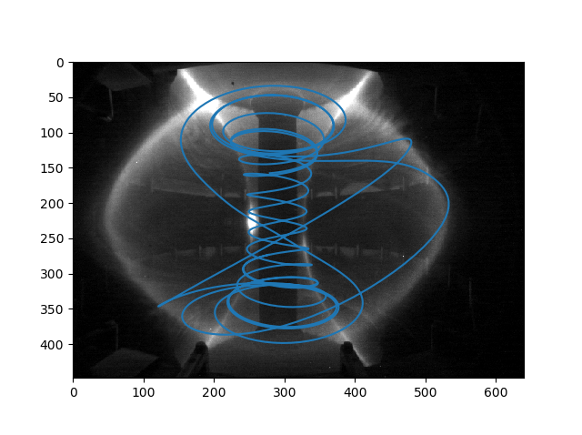
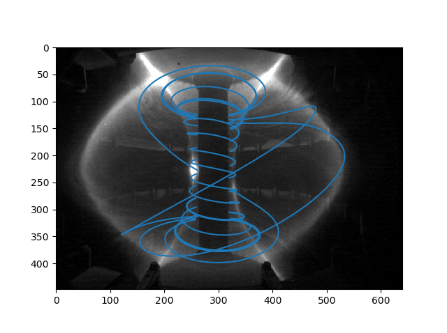

========
Examples
========

Mapping a magnetic field line on to an image
---------------------------------------------
We start from an image of a MAST plasma on to which we want to overlay a magnetic field line:

which we will assume is saved as ``image.png`` in the current directory.
We also have a Calcam calibration for that image stored in the file ``mycalib.ccc``, which for convenience we assume is also saved in the current directory. Finally, we have a ``.csv`` file containing a set of 3D coordinates along the magnetic field line we want to show on the image (generated using a field line tracing tool), as a 3 columns containg X,Y,Z coordinates along the field line and one 3D point per line.

We can plot the field line on top of the image with the following code:

.. code-block:: python

	import calcam
	import numpy as np
	import cv2
	import matplotlib.pyplot as plt

	# Load the image using OpenCV
	cam_image = cv2.imread('image.png')

	# Load the field line coordinates
	fieldline_3d = np.loadtxt('fieldline.csv',delimiter=',')

	# Load the calcam calibration
	cam_calib = calcam.Calibration('mycalib.ccc')

	# Project the field line coordinates to image coordinates using calcam.
	# Note: the [0] index here is because this is a single sub-view image and 
	# we want the image coordinates for sub-view #0.
	fieldline_2d = cam_calib.project_points(fieldline_3d)[0]

	# Plot the projected coordinates on the image.
	plt.imshow(cam_image)
	plt.plot(fieldline_2d[:,0],fieldline_2d[:,1])
	plt.show()

This results in the figure below:

Note that the parts of the field line hidden behind the centre stack are still visible, which looks strange. To only show the parts of the field line which are not hidden behind parts of the machine, we can modify the above code to also load the MAST CAD model and check 

.. code-block:: python

	import calcam
	import numpy as np
	import cv2
	import matplotlib.pyplot as plt

	# Load the image using OpenCV
	cam_image = cv2.imread('image.png')

	# Load the field line coordinates
	fieldline_3d = np.loadtxt('fieldline.csv',delimiter=',')

	# Load the calcam calibration
	cam_calib = calcam.Calibration('mycalib.ccc')

	# Load the MAST CAD model
	mast_machine = calcam.CADModel('MAST')

	# Project the field line coordinates to image coordinates using calcam.
	# This time, check for occlusion of the points by the CAD model.
	# Note: the [0] index here is because this is a single sub-view image and 
	# we want the image coordinates for sub-view #0.
	fieldline_2d = cam_calib.project_points(fieldline_3d,check_occlusion_with=mast_machine)[0] 

	# Plot the projected coordinates on the image.
	# Occluded points now have np.nan in their coordinates, so MatPlotLib skips them
	# and we see only the points not hidden behind bits of CAD model.
	plt.imshow(cam_image)
	plt.plot(fieldline_2d[:,0],fieldline_2d[:,1])
	plt.show()

Which results in the following figure:

Rendering: camera view wireframe
--------------------------------
For this example, we start with a Calcam calibration for a MAST camera, and we want to render a wireframe version of the MAST CAD model which aligns with the camera image, for example to use as an overlay on a camera image to give better context to the image. We can do this with the following code:

.. code-block:: python

	import calcam
	import matplotlib.pyplot as plt

	# Load the calcam calibration
	cam_calib = calcam.Calibration('mycalib.ccc')

	# Load the MAST CAD model and set it to be bright red wireframe
	mast_machine = calcam.CADModel('MAST')
	mast_machine.set_wireframe(True)
	mast_machine.set_colour((1,0,0))

	# Render the image to produce the array rendered_im
	# Also save as an image file "wireframe.png"
	rendered_im = calcam.render_cam_view(mast_machine,cam_calib,filename='wireframe.png')

	# Show the rendered image using matplotlib
	plt.imshow(rendered_im)
	plt.show()

This results in the following plot:

.. image:: images/mast_wireframe_example.png
   :alt: MAST wireframe example

and also the same image saved to the file `wireframe.png`.

Ray casting
-----------
Imagine we have an IR image from a first wall monitoring camera which shows some unusual event at pixel coordinates (100,250). We might want to get the 3D coordinates on the CAD model corresponding to this pixel to tell us where exactly this event took place. We could do this by ray-casting that particular pixel:

.. code-block:: python

	import calcam
	
	# Load the calibration
	cam_calib = calcam.Calibration('my_calibration.ccc')
	
	# Load the CAD model
	jet_machine = calcam.CADModel('JET')
	
	# The coordinates at the wall are given by the returned RayData object's ray_end_coords attribute.
	# Note the 0 index for the first axis because we want the coordinates of the first (and only) point
	# that we ask to be raycast.
	coords = calcam.raycast_sightlines(cam_calib,jet_machine,x=100,y=250).ray_end_coords[0,:]

The 3-element array ``coords`` will then contain the :math:`X,Y,Z` coordinates, in metres, of where the event of interest appened.

Alternatively, we could ray cast every pixel on the detector and then find the coordinates from whiever one(s) we want afterwards:

.. code-block:: python

	import calcam

	# Load the calibration
	cam_calib = calcam.Calibration('my_calibration.ccc')
	
	# Load the CAD model
	jet_machine = calcam.CADModel('JET')
	
	# This time get the wall coordinates at every pixel in the image
	all_coords = calcam.raycast_sightlines(cam_calib,jet_machine).ray_end_coords

	# To get the value at pixel x = 100, y = 250, note we have to index the array the other 
	# way around because of Python's 2D array indexing convention.
	coords = all_coords[250,100,:]