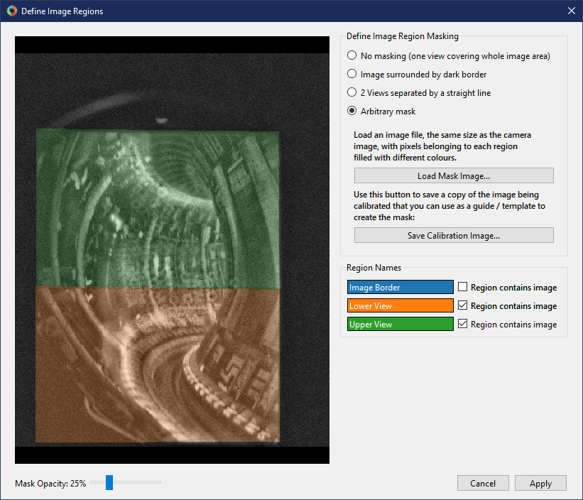

===============================
Calibration by manual alignment
===============================

While the best and most accurate calibration technique is :doc:`gui_calib`, in some cases this is simply not possible because well defined points cannot be identified in the image (e.g. narrow angle camera views which can see only round or curved features on the machine). In this case, Calcam provides a tool for calibration by manually moving the camera view with the mouse until it lines up with the camera image to be calibrated. This will be much more successful if the camera intrinsics can be calibrated accurately, e.g. using chessboard calibration images in the lab, leaving only the extrinsics to be determined "by hand". Manual calibration only currently supports images with a single :ref:`sub-view<subviews_intro>`. The manual alignment calibration tool can be started from the Calcam launcher. The layout of the window is shown below:

.. image:: images/screenshots/alignment_calib_annotated.png
   :alt: Calibration tool screenshot
   :align: left

Loading an Image to Calibrate
-----------------------------------------
At the top of the :guilabel:`Camera Image` control tab is a group of controls for loading an image you want to calibrate. The :guilabel:`From` dropdown list selects the source from which you want to load the image. The options available as standard are loading from an image file (default) or loading an image from another Calcam calibration. If you define any custom image sources (see :doc:`dev_imsources`), they will also appear in this dropdown menu. Once an image source is selected, the relevant inputs to set up the image loading appear below the dropdown list. Once the relevant fields are completed, click the :guilabel:`Load` button to load the image. The image is then displayed in the CAD + Image display on the left of the window. It is not possible to zoom or pan on the image; it is always fit to the window. The CAD model will be displayed behind the image.

Current Image Settings
-----------------------
With an image loaded, the :guilabel:`Current Image` section appears on the :guilabel:`Camera Image` tab, containing information and settings for the current image. Controls include

* **Known Pixel Size**: If you know the pixel size of the camera, it can be entered here. This does not make any difference to the calibration except that focal lengths can be displayed in mm instead of pixels, which can be useful if you know the expected effective focal length of the camera optics.
* **Geometrical Transformations**: Controls for transforming the image to get it the "right way up". It is recommended to always load images in to Calcam the way they come out of the camera as raw, then use these controls to get the image right-way-up for calibration. The :guilabell:Stretch Vertically by' button is provided for cameras with non-square pixels or anamorphic optics.

View Masking
~~~~~~~~~~~~
View masking can be used where the optical image does not fill the entire detector, to mark which parts of the image contain the actual image. This can be set up by clicking the :guilabel:`Define...` button beside the text :guilabel:`Image masking`. Pressing the button opens the following dialog box:

This window shows the image on the left, with any mask shown by different coloured shading. Below the image is a slider which can be used to control the opacity of the shading. Mouse navigation controls for the image are the same as for the image in the main calibration window. On the right-of the window are the different options you can select for defining the image masking:

No Masking
**********
This is the default for a newly loaded image. Use this option if you have a straightforward image with all of the sensor area used.

Image Surrounded by Dark Border
*******************************
This option can be used to mask the image using a flood-fill method. When selected, this option lets you click on areas where there is no image to "flood fill" a mask excluding those pixels from calibration. When you select this option, the entire image is shown shaded in colour. As you click on areas to mark them as not containing image, these ares become shaded grey. Clicking on the image multiple times adds whatever area is clicked to the excluded area. If the flood fill algorithm selects too little or too much of the image, you can adjust the threshold and median filter size for the flood fill algorithm with the provided controls. Increasing these values means a larger area will be selected with each click. If you select too much area to exclude and need to start again, use the :guilabel:`Reset` button to clear the masking and start again. When finished, the part of the sensor containing the image should be shown with a colour overlay while the part containing no image should be shaded grey, like the example below.

Arbitrary Mask
**************
This option can be used to load in an arbitrary image mask, if the flood fill method cannot be used to define the mask sufficiently. To do this, prepare an image file where the pixels containing the image are filled in a single colour and pixels containing no image are filled a different colour. It is often useful to save a copy of the image being calibrated to use as a template / layer when creating the mask image. You can save a copy of the image being calibrated using the :guilabel:`Save Calibration Image...` button.

When you are happy with the image masking configuration, click :guilabel:`Apply`. If you click :guilabel:`cancel`, no change will be applied to the masking configuration.

    Note that the image masking configuration will not affect the GUI display when you are doing the calibration, but the masking is applied to the resulting calibration.

Image display effects
~~~~~~~~~~~~~~~~~~~~~
Applying effects to the image can make it easier to align the image and CAD. The :guilabel:`Image Display` box appears below the :guilabel:`Current Image` box when an image is loaded. Settings available are:
* **No effect**: Display the image, without further processing, semi-transparently on top of the CAD view.
* **Enhance**: Apply image enhancement to improve the contrast of image features.
* **Edge Detection**: Apply a Canny edge detector to the image and display the detected edges only overlaid on the CAD image. When this option is selected, the following extra controls are available: sliders for the edge detection thresholds which can be adjusted to improve the edge detection, and a colour picker to choose the colour of the displayed edges.
* **Display opacity**:  For manual calibration, the image is displayed semi-transparently over the CAD model. When no effect or histogram equilisation are detected, this slider controls the image opacity: slide to the left to make the image less visible, slide to the right to make the image more opaque over the CAD. This slider is not displayed when edge detecion is used, when the edges are displayed at full opacity.

Loading a CAD model
-------------------
At the top the :guilabel:`Machine Model` control tab are controls for loading a CAD model to calibrate against. Two dropdown boxes are provided to select the CAD model to load and the :ref:`model variant <cadmodel_intro>`. The :guilabel:`Load` button to the right of the model variant then loads the model. Underneath the model variant dropdown box is a checkbox labeled `Enable default model features on load`: if checked, the default parts of the CAD model are all loaded as soon as the model itself is loaded. If not checked, the model definition will be loaded but none of the 3D mesh data will be loaded, and instead you can turn on features individually. This is useful if working with a large model on a slow computer where you don't want to wait for the whole model to load if not needed. You can change to a different CAD model or variant at any time by selecting a different item from the dropdown boxes and clicking :guilabel:`Load` again.

Turning CAD model features On/Off
~~~~~~~~~~~~~~~~~~~~~~~~~~~~~~~~~
For CAD models composed of multiple parts in separate mesh files, individual mesh files can be turned on or off by ticking/unticking them in the :guilabel:`Enable / Disable Features` panel. This can be done for individual parts, groups of parts (if defined in the CAD model) or the entire model. This can be helpful to improve performance when working with large models if not all parts are necessary for a particular calibration, or for removing parts which are in the way and make the calibration more difficult.

CAD model rendering type
~~~~~~~~~~~~~~~~~~~~~~~~
In some cases it may be easier to judge the alignment between image and CAD model if the model is rendered in wireframe / outline rather than the usual solid body appearance. For this purpose, at the bottom of the :guilabel:`Machine Model` tab, the CAD model appearance can be switched between solid body and wireframe outline. In addition, the colour of the selected CAD model part can be set.

Performing the alignment calibration
------------------------------------
In contrast to point fitting calibrations, for manual alignment calibrations the camera intrinsics (focal length & distortion) are set separately from the extrinsics (position and viewing direction). The sections below explain how to set each.

Camera Intrinsics
~~~~~~~~~~~~~~~~~
The camera intrinsics are set using the top part of the :guilabel:`Alignment Calibration` control tab. Camera intrinsics can be set 3 different ways: using intrinsics from an existing calibration (e.g. to calibrate an existing camera & lens setup moved to a new view), using chessboard calibration pattern images from lab measurements, or using a simple pinhole camera model. It is highly recommended to use chessboard images, if possible, or another calcam calibration since this is likely to give much better results and will probably be easier.

Existing Calibration Intrinsics
*******************************
To use intrinsics from an existing Calcam calibration, select :guilabel:`Use intrinsics from existing calibration` and browse for the calibration you want to use. The loaded calibration can be changed using the :guilabel:`Load...` button. Any image masking in the loaded calibration will also be applied (this can be edited as described in the view masking section, above).

Chessboard Calibration Intrinsics
*********************************
To prepare chessboard images: make a flat chessboard target with known square size (there are various printable PDFs available by searching online). Then take a number of images with this chessboard target in front of the camera at a variety of positions, orientations and distances to the camera. The example below shows thumbnails of a set of chessboard calibration images:

.. image:: images/chessboard_example.png
   :alt: Chessboard image example thumbnails
   :align: left

To use the chessboard images to define the camera intrinsics, select :guilabel:`Calibrate from chessboard images`. The first time this option is selected it will open the following window:

.. image:: images/screenshots/chessboard_intrinsics_dialog.png
   :alt: Chessboard dialog screenshot
   :align: left

Chessboard loading consists of 4 steps, done in order by working down the right hand side of this window. First, browse for and select all of the chessboard images to use. Then, enter the details of the chessboard pattern: number of squares and square size. Next, select the :guilabel:`Detect Chessboard Corners` button to run an automatic detection of the boundaries between the chessboard squares. If the automatic detection fails on some images, a dialog box will open telling you which images the detection failed for, and that those cannot be used. If all images fail, check that the number of squares input is correct. Once the corner detection has been completed, cursors will be added to the image displayed on the left hand side of the window. You can pan and zoom to inspect the cursor positions using the usual image mouse controls, and look at different images using the :guilabel:`<<` and :guilabel:`>>` buttons above the image. Finally, select whether to use the rectilinear lens model or fisheye lens model. To complete loading of the images and use these to define the camera intrinsics constraints, click :guilabel:`Apply`.

Pinhole Intrinsics
******************
If accurate intrinsics calibration is not available, an idealised pinhole camera model can be used to define the intrinsics. In this case, the centre of perspective is assumed to be at the image centre and the effective focal length is the only free parameter. To use the pinhole camera model, select :guilabel:`Use ideal pinhole camera model`. The focal length is set in the :guilabel:`Focal Length` box. If the physical camera pixel size has not been entered, this focal length is in units of pixels. If a physical pixel size has been entered on the :guilabel:`Camera Image` tab, the focal length is input in millimetres.

Camera Extrinsics
~~~~~~~~~~~~~~~~~
The camera extrinsics are set by manually adjusting the CAD model view until it lines up as well as possible with the image displayed on top. This can be done by a combination of mouse controls and manually inputting numerical values. As with the intrinsics, the extrinsics are set on the :guilabel:`Alignment Calibration` control tab.

Starting from an existing view
******************************
It will often make the alignment easier to start from a view either defined in the CAD model definition or from another Calcam calibration. In the :guilabel:`Camera Positioning` box, the list of views defined in the CAD model are displayed, and clicking on one of these will immediately set the camera position and orientation to match that view. The field of view from the preset view will not be set, since this is determined by the camera intrinsics which are set separately. To use the extrinsics from an existing Calcam calibration, click the :guilabel:`Load...` button underneath the view list to choose a calibration file to load. This will set the camera extrinsics to match the loaded calibration, and add that calibration to the list view box so it can be returned to easily.

Mouse & Keyboard Controls
*************************

Adjustment of the CAD view to match the image view is via the mouse and keyboard:

- :kbd:`Right Click + Drag` - Look around (first-person shooter style control; default) or rotate CAD model depending on settings
- :kbd:`Middle Click + Drag` - Pan (translate) sideways i.e. in the plane of the monitor.
- :kbd:`Scroll Wheel` - Move forwards or backwards.
- :kbd:`Ctrl + Right Click + Drag` - Roll the camera (rotate about the direction of view)

- :kbd:`W/A/S/D` or :kbd:`↑/←/↓/→` - Move the camera around as if walking, similar to first-person game controls.

For finer control, the mouse and keyboard movement sensitivity can be adjusted using the slider in the :guilabel:`Mouse Control Settings` box at the bottom of the control tab.

Manual Entry
************
If the camera position and view direction are already approximately known, these can be entered in the boxes at the bottom of the :guilabel:`Camera Positioning` box. 

Saving / Loading and viewing calibration information
----------------------------------------------------
Once a satisfactory calibration has been obtained, the calibration can be saved to a Calcam calibration (``.ccc``) file using the :guilabel:`Save` / :guilabel:`Save As` buttons on the toolbar at the top of the window. The resulting file can then be loaded in the :doc:`gui_image_analyser` tool or in Python with the :class:`calcam.Calibration` class to make use of the calibration.

As with any application, it is advised to save your work regularly to reduce the risk of software or user errors.

.. note::
    Whenever the save button is clicked, the camera extrinsics in the saved calibration will correspond go the current view in the GUI window.

Existing manual alignment calibrations can be loaded using the :guilabel:`Open` button in the toolbar at the top of the window. This will load the image, extrinsics and intrinsics from the saved calibration. If the CAD model which was last used for thet calibration is available, it will also load and set up the CAD model as it was the last time that file was edited.

Information about the current calibration can be viewed using the :guilabel:`Calibration Information` button on the toolbar.
