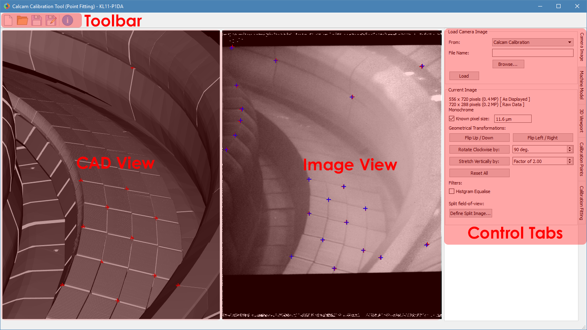
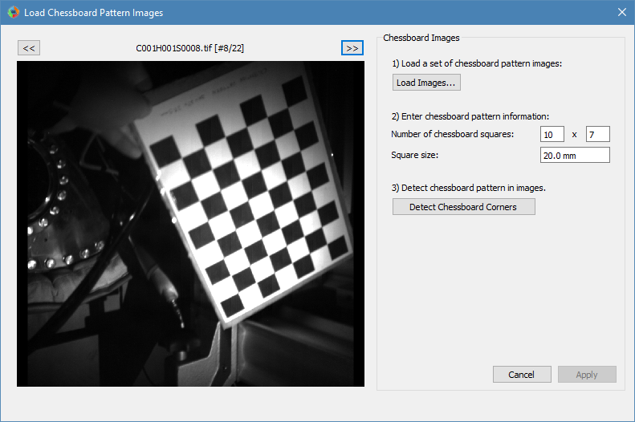

=============================
Calibration by point fitting
=============================
The point fitting calibration tool is the main GUI tool for performing camera calibrations. An image from a camera to be calibrated and a CAD model of the camera's view are shown side-by-side, and the user then identifies pairs of corresponding points between the image and CAD model. These point pairs are then used to fit the camera calibration.

A screenshot of the calibration tool GUI is shown below, with the main areas annotated. At the top of the window is a toolbar with buttons to start a new calibration, open a calibration or save / save as for the opened calibration. Most of the space in the main window is taken by the side-by-side CAD and image views, where the CAD model and image to be calibrated are displayed. On the right-hand side of the window are the "control tabs", a set of tabs where the rest of the controls reside.

Loading an Image to Calibrate
-----------------------------------------
At the top of the :guilabel:`Camera Image` control tab is a group of controls for loading an image you want to calibrate. The :guilabel:`From` dropdown list selects the source from which you want to load the image. The options available as standard are loading from an image file (default) or loading an image from another Calcam calibration. If you define any custom image sources (see :doc:`dev_imsources`), they will also appear in this dropdown menu. Once an image source is selected, the relevant inputs to set up the image loading appear below the dropdown list. Once the relevant fields are completed, click the :guilabel:`Load` button to load the image.

Image Mouse Navigation
-----------------------
Once an image is loaded, you can interactively zoom and pan the image with the following mouse controls:

- :kbd:`Scroll Wheel` - Zoom in or out, centred at the current mouse position.
- :kbd:`Middle Click + Drag` - Drag the image around.

Current Image Settings
-----------------------
With an image loaded, the :guilabel:`Current Image` section appears on the :guilabel:`Camera Image` tab, containing information and settings for the current image. Controls include

* **Known Pixel Size**: If you know the pixel size of the camera, it can be entered here. This does not make any difference to the calibration except that focal lengths can be displayed in mm instead of pixels, which can be useful for sanity checking results e.g. comparing with optical designs or known lenses.

* **Geometrical Transformations**: Controls for transforming the image to get it the "right way up". It is recommended to always load images in to Calcam the way they come out of the camera as raw, then use these controls to get the image right-way-up for calibration. The :guilabell:Stretch Vertically by' button is provided for cameras with non-square pixels or anamorphic optics.

* **Histogram Equilise** (only available with OpenCV 3.0+): Toggle adaptive histogram equilistion on the image display; turning this on will increase the image contrast to mak it easier to see features in the image.

Images with multiple sub-views
~~~~~~~~~~~~~~~~~~~~~~~~~~~~~~
If the image to be calibrated contains multiple :ref:`subviews_intro`, this can be set up by clicking the :guilabel:`Define Sub-Views` button at the bottom of the image controls, which opens the below window:

.. image:: images/screenshots/subviews.png
   :alt: Sub-view window screenshot
   :align: left

This window shows the image on the left, with the different sub-views tinted in different colours. Below the image is a slider which can be used to control the opacity of this tint effect to. Mouse navigation controls for the image are the same as for the image in the main calibration window. On the right-of the window are 3 options for defining which pixels in the image belong to which sub-view:

* **No Split Field-of-View**: If the image does not have a split field-of-view (i.e. only contains a single subview) as is the case for most images. This is the default for images loaded from image files.

* **2 Sub-views separated by a straight line**: The simplest case for a split-view image. If this option is selected, click two points on the image to define the line which separates the two sub-views. Once the points are placed, clicking on the image again moves the selected point (shown in green) to the clicked position. The other point can be selected by clicking it.

* **Custom mask** for images with more than 2 sub-views or where the boundary between the sub-views is not a straight line. To use this function, prepare an image file the same size as the image to be calibrated with blocks of different solid colours representing each sub-view. You can then load this image file and the blocks of different colours will be used to define the coverage of the different sub-views.

Once the positions of the sub-views have been configured, on the lower-right of the window are boxes to enter human-friendly names for the different sub-views. These will be used to identify the sub-views elsewhere in the GUI and calibration information.

Once this is all set to your satisfaction, click :guilabel:`Apply` to apply the sub-view configuration and return to the main window. Clicking :guilabel:`Cancel` will return to the main window without making any changes.

Loading and manipulating a CAD model
------------------------------------
At the top the :guilabel:`Machine Model` control tab are controls for loading a CAD model to calibrate against. Two dropdown boxes are provided to select the CAD model to load and the :ref:`model variant <cadmodel_intro>`. The :guilabel:`Load` button to the right of the model variant then loads the model. Underneath the model variant dropdown box is a checkbox labeled `Enable default model features on load`: if checked, the default parts of the CAD model are all loaded as soon as the model itself is loaded. If not checked, the model definition will be loaded but none of the 3D mesh data will be loaded, and instead you can turn on features individually. This is useful if working with a large model on a slow computer where you don't want to wait for the whole model to load if not needed. You can change to a different CAD model or variant at any time by selecting a different item from the dropdown boxes and clicking :guilabel:`Load` again.

CAD Mouse Navigation
~~~~~~~~~~~~~~~~~~~~
You can interactively navigate around the CAD model using the following mouse controls:

- :kbd:`Right Click + Drag` - Look around (first-person shooter style control; default) or rotate CAD model depending on settings
- :kbd:`Middle Click + Drag` - Pan (translate) sideways i.e. in the plane of the monitor.
- :kbd:`Scroll Wheel` - Move forwards or backwards.
- :kbd:`Ctrl + Scroll Wheel` Reduce or increase the CAD field-of-view angle (i.e. Zoom)
- :kbd:`Ctrl + Right Click + Drag` - Roll the camera (rotate about the direction of view)

Turning CAD model parts On/Off
~~~~~~~~~~~~~~~~~~~~~~~~~~~~~~~~~
For CAD models composed of multiple parts in separate mesh files, individual mesh files can be turned on or off by ticking/unticking them in the :guilabel:`Enable / Disable Features` panel. This can be done for individual parts, groups of parts (if defined in the CAD model) or the entire model. This can be helpful to improve performance when working with large models if not all parts are necessary for a particular calibration, or for removing parts which are in the way and make the calibration more difficult.

3D ViewPort Tab
~~~~~~~~~~~~~~~~
In addition to the mouse controls, the :guilabel:`3D Viewport` tab  can be used to control the current view of the CAD model. At the top of this tab is a list of viewports defined in the CAD model definition. Clicking on a view in this pane immediately changes the CAD viewport to that view. You can also set the view to match an existing calibrated camera by clicking the :guilabel:`Add from calibration(s)...` button below the viewport list. You can then select one or more Calcam calibration files to load, and the views defined by the calibration will be added to the viewport list on the 3D Viewport tab. 

If you want to save the current view of the CAD model in to the model definition so you can easily return to it, enter a name in the :guilabel:`Name` box under the heading :guilabel:`Save current view as preset` and click :guilabel:`Save`. The view will then be added to the viewport list, and if the model definition you are using is not read-only, will be saved to the model definition for future use.

Near the bottom of the tab are editable boxes showing the current viewport's camera position, camera view target, field of view and roll. These update automatically to reflect the current viewport, and you can manually set up the CAD view by editing these.

At the bottom of this tab are options for configuring the mouse controls for CAD navigation. The :kbd:`Right Click + Drag` behaviour can be toggled between looking around and rotating the model about a point in front of the camera, and the mouse sensitivity can be adjusted.

Defining Calibration Points
---------------------------
Calcam uses *point pairs* to perform the calibration, where a point pair consists of one point on the CAD model and its corresponding point on the image. Point pairs are displayed on the CAD and image views as red **+** cursors at the point locations. At any given time, one point pair can be selected for editing. The selected point pair will be indicated with larger green **+** cursors. 

Once you have identified a common feature on the image and CAD model, :kbd:`Ctrl + Click`  on the location on either the image or CAD view to create a new point pair. A point will be placed at the mouse location. Then click, without holding :kbd:`Ctrl`, the corresponding point on the other view to finish creating the point pair. You should now see green cursors on both the CAD model and image. Clicking either the CAD model or image again will move the green cursor representing the current point to the clicked location. To start another point pair, :kbd:`Ctrl + Click` again and repeat the process. The cursors showing the existing points will turn red, indicating they are no longer selected. In general, left clicking on either the image or CAD model will move the currently selected point to the clicked location. Clicking an existing cursor will select that point pair for editing, and holding :kbd:`Ctrl` while clicking will start a new point pair.

If you start a new point pair before specifying both CAD and image points for an existing pair (e.g. by :kbd:`Ctrl+Click` on the image twice in a row), this will delete the current 'un-paired' point and start a new point pair.

The currently selected point pair can be deleted by pressing the :kbd:`Del` key on the keyboard, or clicking the :guilabel:`Remove selected` button on the :guilabel:`Calibration Points` tab.

For more information, the current number of calibration points and coordinates of the currently selected points are shown in the :guilabel:`Calibration Points` control tab.

You can load a set of point pairs from an existing calcam calibration or point pairs ``.csv`` file as a starting point on the :guilabel:`Calibration Points` tab.

Using Additional Intrinsics Constraints
~~~~~~~~~~~~~~~~~~~~~~~~~~~~~~~~~~~~~~~
In many examples of real images, only a relatively small number of point pairs can be accurately identified. Due to the large number of free parameters in the camera model fit (focal length(s), centre of perspective, camera 3D position and orientation and distortion parameters) this can often give poor quality results. It is possible to better constrain the fits by using either existing calcam calibrations of the same camera + lens, or with images of a chessboard pattern, with known square size, taken with the same camera & lens in the lab. These add aditional constraints on the intrinsic model parameters, meaning only enough points to reliably fit the extrinsic parameters need to be identified in the image of the machine and better quality fits can be achieved. Extra intrinsics constraints can be loaded on the :guilabel:`Calibration Points` tab, under the :guilabel:`Additional Intrinsics Constraints` section. This section provides :guilabel:`Load...` buttons for both types of constraints. Once loaded, these can be included or excluded from being used for the fitting using the checkboxes next to the intrinsics constraint names.

Chessboard Images
*****************
It is recommended to take chessboard images for intrinsics calibration whenever possible to improve calibraition results. The images bust be taken with exact camera and lens configuration as used on the machine.

To prepare chessboard images: make a flat chessboard target with known square size (there are various printable PDFs available by searching online). Then take a number of images with this chessboard target in front of the camera at a variety of positions, orientations and distances to the camera. The example below shows thumbnails of a set of chessboard calibration images:

.. image:: images/chessboard_example.png
   :alt: Chessboard image example thumbnails
   :align: left

Chessboard images are loaded in to Calcam from the :guilabel:`Calibration Points` tab. Clicking the :guilabel:`Load...` button next to Chessboard Images in the :guilabel:`Additional Intrinsics Constraints` section will open the following window:

Chessboard loading consists of 3 steps, done in order by working down the right hand side of this window. First, browse for and select all of the chessboard images to use. Then, enter the details of the chessboard pattern: number of squares and square size. Then, select the :guilabel:`Detect Chessboard Corners` button to run an automatic detection of the boundaries between the chessboard squares. If the automatic detection fails on some images, a dialog box will open telling you which images the detection failed for, and that those cannot be used. If all images fail, check that the number of squares input is correct. Once the corner detection has been completed, cursors will be added to the image displayed on the left hand side of the window. You can pan and zoom to inspect the cursor positions using the usual image mouse controls, and look at different images using the :guilabel:`<<` and :guilabel:`>>` buttons above the image. To complete loading of the images and use these as intrinsics constraints, click :guilabel:`Apply`.

Existing Calibrations
*********************
If loading an existing calibration to use for intrinsics constraint, the intrinsics from the existing calibration are not used directly for the new one, but rather the point pairs from the main image and any additional intrinsics constraints (e.g. chessboard images) already included in that calibration will be used as additional fit input data to constrain the camera intrinsics. Copies of the image(s) and point pairs from the opened calibration will be stored in the new calibration to maintain full traceability of the input data used for the calibration.

Fitting the camera model
------------------------
Once enough point pairs have been identified, fitting of the camera model and checking the fit accuracy are done using the :guilabel:`Calibration Fitting` tab. At the top of this page is a set of tabs concerning each sub-view in the image, since each sub-view is calibrated independently. The following description of the fitting options and results display applies to each tab.

Fit Options
~~~~~~~~~~~
At the top of the page are the fitting & camera model options. The default options will typically produce good results for most images, however in some cases they will need to be adjusted to get a good quality result. 

The first option to choose is whether to use the perspective or fisheye lens distortion model: these two can be switched using the radio buttons at the top of the fit options section. Depending on the selected model, some or all of the following options will be available:

- :guilabel:`Disable k1...k3` These options, when checked, cause the corresponding radial distortion coefficients in the distortion model to be fixed at 0 in the fit. This can be used to change the order of the radial distortion model, and disables radial distortion entirely if all three are checked. Disabling higher order radial distortion terms can improve fits when the point pairs do not sufficiently constrain the distortion model, when the fitted results can show large erroneous distortions.
- :guilabel:`Disable Tangential Distortion` This option sets the coefficients :math:`p_1` and :math:`p_2` in the distortion model to be fixed at 0 in the fit, i.e. disables tangential distortion in the fitted model. This can be helpful if the fitting results in large erroneous values of these coefficients.
- :guilabel:`Fix Fx = Fy` This option fixes the focal lengths in the horizontal and vertical directions to be equal, i.e. fixes the image aspect ratio to 1. This is enabled by default, since for square pixels and non-anamorphic optics, which is the typical case, :math:`f_x = f_y` is expected. Un-checking this option can sometimes help fit quality for some optical systems.

At the bottom of the fit options section is the :guilabel:`Do Fit` button which is used to run the fit with the current options. Alternatively, the keyboard shortcut :kbd:`Ctrl + F` also performs a fit with the current settings for the current sub-view.

Fit Results & Checking Accuracy
~~~~~~~~~~~~~~~~~~~~~~~~~~~~~~~
As soon as a fit is performed, a set of re-projected points are shown on the image as blue  **+** cursors. These are the CAD model points from the current point pairs converted to image coordinates using the fitted model, i.e. for a good fit, these should lie on top of the user-placed red cursors. Display of the fitted points can be turned on or off using the :guilabel:`Show fitted points` checkbox in the :guilabel:`Fit Results Inspection` control group, or pressing :kbd:`Ctrl + P` on the keyboard. Once a fit is performed, a :guilabel:`Fit Results` section is displayed below the fit options and contains quantitative information about the fit results. These include the RMS fit residual and fitted extrinsic and intrinsic parameters (camera pupil position and view direction, field of view, focal length, centre of perspective and distortion parameters). *Beware*: for fits with small numbers of point pairs, the camera model has sufficiently many free parameters that a very small RMS fit error and good looking re-projected point positions can be obtained with a fit which is actually very bad!

A much more most robust and thorough visual check of the fit quality can be obtained by overlaying the CAD model wireframe on top of the camera image, with the wireframe rendered according to the fit results. Careful inspection of the alignment of this wireframe overlay is the recommended method for checking fit results. The overlay can be turned on by ticking the :guilabel:`Show wireframe overlay` checkbox in the :guilabel:`Fit Results Inspection` control group. The CAD model is then rendered in wireframe and superimposed on the image. Note: for large images or CAD models this can be somewhat slow and memory intensive, particularly the first time it is run. The colour and transparency of the wireframe overlay can be set by clicking the :guilabel:`Select Colour...` button next to the checkbox; chaning the overlay colour and transparency can be useful for making the comparison between image and overlay more visually clear.

Another way to quickly get a rough idea of the fit quality, or to make subequent adding or editing of point pairs easier, is to set the CAD viewport to match the fitted model using the :guilabel:`Set CAD view to match fit` button. This will set the view of the CAD model to approximately match the fitted camera, including the position, orientation and overall field of view but neglecting any distortion and de-centring. 

Note: Fit results are cleared automatically the next time the point pairs are edited in any way, to ensure any fit displayed or saved always corresponds to the current state of the point pairs.

Comparison with another calibration
~~~~~~~~~~~~~~~~~~~~~~~~~~~~~~~~~~~
It may sometimes be desirable to compare the current calibration fit with a different calibration of the same camera, e.g. to judge the improvement of calibration accuracy compared to a previous version, or to see camera movement between an existing calibration and the current one. To enable this, it is possible to show the CAD wireframe overlay from a different calibration file on the image in addition to the one based on the current calibration fit. The controls for this are in the :guilabel:`Compare with existing Calibration` control group at the bottom of the :guilabel:`Calibration Fitting` tab. Clicking :guilabel:`Select...` will open a file browing dialog where you can choose the other calibration that you want to compare. The other calibration must be for an image with the same pixel dimensions (in display orientation) as the current calibration. Once loaded, the name of the reference calibration is displayed to the left of the :guilabel:`Select...` button. The CAD wireframe based on the loaded calibration is then rendered and placed on top of the image similarly to the one from the current calibration, and can be turned on or off using the :guilabel:`Show wireframe overlay` checkbox. Like the wireframe overlay from the current fit, the colour and opacity of the comparison overlay can be changed by clicking the :guilabel:`Select Colour...` button.

Saving / Loading and viewing calibration information
----------------------------------------------------
Once a satisfactory calibration has been obtained, the calibration can be saved to a Calcam calibration (``.ccc``) file using the :guilabel:`Save` / :guilabel:`Save As` buttons on the toolbar at the top of the window. The resulting file can then be loaded in the image analyser tool or using the Calcam :doc:`Python API <api_analysis>` to make use of the calibration. As with any computer application, it is advised to save your work regularly in case of computer crash or user error. You do not have to have a complete calibration in order to save; a calibration containing just an image, an image and point pairs or a full set of image, point pairs and fit can be saved and returned to later.

Existing calibrations can be loaded using the :guilabel:`Open` button in the toolbar at the top of the window. This will load the image, point pairs and fit results from the selected calibration file. If the CAD model which was last used for thet calibration is available, it will also load and set up the CAD model as it was the last time that file was edited.

Information about the current calibration can be viewed using the :guilabel:`Calibration Information` button on the toolbar.