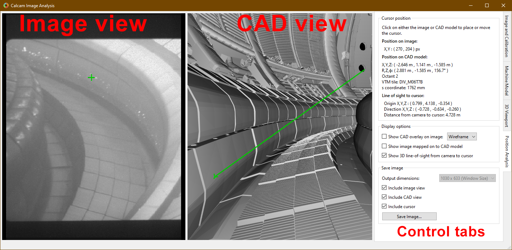

==============
Image Analyser
==============
The Calcam image analyser tool provides a convenient interactive way to convert between 2D image positions and 3D real space positions, given a Calcam calibration and camera image. While more flexible analysis functionality can be built using the python API, this tool provides a fast and convenient way to do basic image position analysis.

The image analyser window is shown below:

Loading an image to analyse
---------------------------
At the top of the :guilabel:`Image and Calibration` control tab is a group of controls for loading an image you want to analyse. The :guilabel:`From` dropdown list selects the source from which you want to load the image. The options available as standard are loading from an image file (default) or loading an image from another Calcam calibration. If you define any custom image sources (see :doc:`dev_imsources`), they will also appear in this dropdown menu. Once an image source is selected, the relevant inputs to set up the image loading appear below the dropdown list. Once the relevant fields are completed, click the :guilabel:`Load` button to load the image. Note: if the image is loaded before any calibration, it may be displayed in its original orientation until a calibration is loaded. Basic information about the current image id displayed in the :guilabel:`Image` box. 

Image enhancement & colour mapping
~~~~~~~~~~~~~~~~~~~~~~~~~~~~~~~~~~
It is often helpful to apply a colour map to monochrome images to make different pixel values more visibly distinct. If a monochrome image is loaded, a colour map can be applied by selecting the :guilabel:`Apply colour mapping` checkbox on the :guilabel:`Image and Calibration` control tab. The colour map can be selected from a list of common MatPlotLib colour maps and the minimum and maximum values for the colour mapping can be set.

For either monochrome or colour images, image enhancement can be applied to try to make image details more easily visible, using the :guilabel:`Apply Image Enhancement` checkbox on the :guilabel:`Image and Calibration` tab. Note: image enhancement and colour mapping cannot be applied simultaneously; turning one on will turn off the other.

If the image is shown in the 3D view mapped to the CAD model (see :ref:`image_projection`), the colour map / image enhancement is also applied to the image projected on to the CAD view.

Loading a Calibration
---------------------
The calibration to use for the analysis is also controlled on the :guilabel:`Image and Calibration` control tab. To load a calibration to use for the analysis, click the :guilabel:`Load...` button in the :guilabel:`Calibration for analysis` box. This box also displays the name of the currently loaded calibration, and full details of the calibration can be viewed by clicking the :guilabel:`Properties...` button in this box.

If the loaded calibration contains information about the CAD model settings last used when the calibration was edited, the applicable CAD model will be automatically loaded, if available. The CAD view will also be set to match the camera view automatically when the calibration is loaded.

The :guilabel:`Movement Correction...` button can be used to check for, and adjust, any mis-alignment between the loaded image and calibration e.g. if the camera has moved slightly since it was calibrated. For more information see the :ref:`movement_correction` section below.

Loading a CAD model
--------------------
If the CAD model is not loaded automatically when loading the calibration, or you want to change the CAD model used, this is controlled on the :guilabel:`Machine Model` control tab. At the top of this tab are controls for loading a CAD model. Two dropdown boxes are provided to select the CAD model to load and the :ref:`model variant <cadmodel_intro>`. The :guilabel:`Load` button to the right of the model variant then loads the model. Underneath the model variant dropdown box is a checkbox labeled `Enable default model features on load`: if checked, the default parts of the CAD model are all loaded as soon as the model itself is loaded. If not checked, the model definition will be loaded but none of the 3D mesh data will be loaded, and instead you can turn on features individually. This is useful if working with a large model on a slow computer where you don't want to wait for the whole model to load if not needed. You can change to a different CAD model or variant at any time by selecting a different item from the dropdown boxes and clicking :guilabel:`Load` again.

Turning CADmodel features On/Off
~~~~~~~~~~~~~~~~~~~~~~~~~~~~~~~~~
For CAD models composed of multiple parts in separate mesh files, individual mesh files can be turned on or off by ticking/unticking them in the :guilabel:`Enable / Disable Features` panel. This can be done for individual parts, groups of parts (if defined in the CAD model) or the entire model. This can be helpful to improve performance when working with large models if not all parts are necessary for a particular calibration, or for removing parts which are in the way and make the calibration more difficult. 

View navigation
---------------

Both the image view and CAD view can be manipulated using the following controls:

Image mouse navigation
~~~~~~~~~~~~~~~~~~~~~~
The image can be manipulated at any time using the following mouse controls:

- :kbd:`Scroll Wheel` - Zoom in or out, centred at the current mouse position.
- :kbd:`Middle Click + Drag` - Drag the image around.

CAD view navigation
~~~~~~~~~~~~~~~~~~~
You can interactively navigate around the CAD model using the following mouse controls:

- :kbd:`Right Click` + :kbd:`Move mouse` - Look around (first-person game stype control; default) or rotate CAD model depending on settings
- :kbd:`Middle Click` + :kbd:`Move mouse` - Pan (translate) sideways i.e. in the plane of the monitor.
- :kbd:`Scroll Wheel` - Move forwards or backwards.
- :kbd:`Ctrl` + :kbd:`Scroll Wheel` - Reduce or increase the CAD field-of-view angle (i.e. Zoom)
- :kbd:`Ctrl` + :kbd:`Right Click` + :kbd:`Move mouse` - Roll the camera (rotate about the direction of view)

and keyboard keys:

- :kbd:`W` :kbd:`A` :kbd:`S` :kbd:`D` or :kbd:`↑` :kbd:`←` :kbd:`↓` :kbd:`→` - Move the camera around as if walking forward, backward left or right. Note the camera only moves in one direction at once (not diagonally) according to the most recently pressed key.

In addition to the mouse controls, the :guilabel:`3D Viewport` tab  can be used to control the current view of the CAD model. At the top of this tab is a list of viewports defined in the CAD model definition. Clicking on a view in this pane immediately changes the CAD viewport to that view. Additional view positions can be added to this list from a Calcam calibration file using the :guilabel:`Add from calibration(s)...` button below the viewport list. You can then select one or more Calcam calibration files to load, and the views defined by the calibration will be added to the viewport list on the 3D Viewport tab.

The :guilabel:`Quick view options` section below the viewport list contains two buttons for fast manipulation of the 3D CAD view: :guilabel:`Reset View to match image` will reset the CAD view to match the view of the camera, i.e. provides a similar view to the image. The :guilabel:`Show cursor close-up` button moves the 3D view to show the location of the cursor on the CAD model, if one exists.

If you want to save the current view of the CAD model in to the model definition so you can easily return to it, enter a name in the :guilabel:`Name` box under the heading :guilabel:`Save current view as preset` and click :guilabel:`Save`. The view will then be added to the viewport list, and if the model definition you are using is not read-only, will be saved to the model definition for future use.

Near the bottom of the tab are editable boxes showing the current viewport's camera position, camera view target, field of view and roll. These update automatically to reflect the current viewport, and you can manually set up the CAD view by editing these.

At the bottom of this tab are options for configuring the mouse controls for CAD navigation. The :kbd:`Right Click + Drag` behaviour can be toggled between looking around and rotating the model about a point in front of the camera, and the mouse sensitivity can be adjusted.

.. _movement_correction:

Checking & Adjusting Calibration Accuracy
-----------------------------------------
When using a Calcam calibration to analyse an image, it is often desirable to check if the loaded calibration agrees well with the current image, for example to check if the camera has moved since the time it was calibrated, and to be able to make adjustments to improve accuracy if the camera has moved. The image analyser contains features which can help with this:

CAD Overlay
~~~~~~~~~~~
Similarly to the fitting calibration tool, a view of the CAD model rendered based on the loaded calibration and be overlaid on the loaded image. This can be used to confirm that the calibration is accurate for the loaded image, since for an accurate calibration, the overlay should align perfectly with the image. The CAD overlay can be turned on and off on the :guilabel:`Position Analysis` tab, under :guilabel:`Display options`. By default this shows the CAD model in wireframe, but can be changed to a solid-body view of the CAD model with the dropdown box next to the :guilabel:`Show CAD overlay on image` checkbox. The colour and transparency of the CAD overlay can be adjusted with the controls which appear below this checkbox when enabled. If the CAD model overlay shows the calibration is not well aligned, see the following section for instructions to make adjustments.

Movement correction tool
~~~~~~~~~~~~~~~~~~~~~~~~
The image movement determination tool can be opened from the :guilabel:`Image and Calibration` tab, using the :guilabel:`Movement Correction...` button. This opens the calcam movement correction GUI, with the image stored in the calibration (i.e. the one used to produce the calibration) as the reference image and the currently loaded image as the current image. This allows the user to determine, and correct, any misalignment between the originally calibrated image and the current one, to ensure accurate results. For details of how to use this interface, see the :doc:`gui_movement` page. When satisfied, if you click :guilabel:`OK` in the movement correction tool, the currently loaded camera image will be warped, based on the determined movement, to align better with the calibration. Note that any displayed image pixel coordinates when performing subsequent analysis will have this warping accounted for, so pixel coordinates are still accurate with respect to the image as it was loded, with no warping. If instead :guilabel:`Cancel` is clicked in the movement correction interface, the movement correction will not be updated (i.e. it will stay the same as before the movement correction dialog opened, which may be no movement correction).

Performing Position Analysis
----------------------------

Placing cursors and obtaining coordinates
~~~~~~~~~~~~~~~~~~~~~~~~~~~~~~~~~~~~~~~~~
With an image, calibration and CAD model loaded, clicking on either the CAD model view or image will place a cursor at the clicked position (or move the existing cursor to the clicked position). A cursor will also appear showing the corresponding position on the other view (image or CAD model). Quantitative information about the current cursor position is displayed on the :guilabel:`Position Analysis` tab, including:

* Pixel coordinates of the position in the image (rounded to the nearest pixel)
* 3D position in the CAD model in cartesian and cylindrical coordinates
* The 3D vector line of sight between the camera and cursor
* The distance from the camera to the cursor 

If the camera has multuple sub-views and the clicked position is visible in more than one sub-view, the pixel coordinate, line of sight vector and distance are displayed for each sub-view.

The cursor will be green if the chosen position is visible to the camera. If the cursor is placed on the CAD model at a position not visible to the camera, the cursor turns magenta on the CAD model view. If the cursor position is within the image field of view but hidden behind part of the CAD model from the camera's point-of-view, a magenta cursor will also appear on the image at the position where that point would be if it was not hidden from view.

By default, the CAD model view will also show a solid green line in 3D representing the line of sight from the camera to the cursor position. A magenta line shows the continuation of the sight-line after it has passed the cursor. If the cursor is hidden from the camera's view, a green sight-line is shown up to the point where the sight-line hits the object hiding the cursor, then the remainder of the sight-line is shown in red. Display of the line-of-sight vector can be turned on or off using a checkbox on the :guilabel:`Position Analysis` tab.

.. _image_projection:

Projecting images to the CAD model
~~~~~~~~~~~~~~~~~~~~~~~~~~~~~~~~~~
For cameras observing the surfaces of the device, e.g. infrared thermography cameras, it can be useful to visualise the camera data mapped on to the surface of the CAD model. This can be done by activaing the :guilabel:`Show image mapped on to CAD model` checkbox on the :guilabel:`Position Analysis` tab.

.. note::
    When activating this feature for the first time with a given calibration, the process to calculate the projection can be very slow, particularly with complex CAD models and/or high resolution images. During this time the application will show a "busy" mouse cursor. After this, turning the projection off then back on, or making adjustments to the image e.g. changing colour mapping, enhancement or movement correction options will not take significant time since the mapping does not need to be re-calculated.

Exporting Images
----------------
When performing image analysis using this tool it may be useful to export the current 2D and/or 3D views to use to illustrate the results. This can be done using the controls in the :guilabel:`Save image` section of the :guilabel:`Position Analysis` tab. If including the 2D image view the output image size is limited such that the camera image will appear "actual size" in the output, however if only including the 3D / CAD view, the output image can be rendered at higher resolutions selected with the :guilabel:`Output dimensions` dropdown box.
