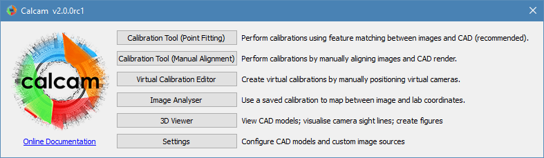

=============================
Introduction & Launcher
=============================

Calcam consists of 5 main GUI tools both for performing calibrations and visualising the results / doing some basic image position analysis, which can all be conveniently accessed via the Calcam GUI launcher interface. The launcher is shown below:

The buttons to the right-hand side of the Calcam logo each open a new python instance running the selected GUI, and a link to the online copy of this documentation is provided under the logo. The launcher will also check whether you are using the most recent release version of Calcam and will display a message at the bottom of the window alerting you if a newer version is available. More details of each of the tools are given below.

Starting the launcher
---------------------

From the command line
~~~~~~~~~~~~~~~~~~~~~
At installation, the setup script will create a launcher for the Calcam GUI in your Python environment's script directory. If this directory is in your OS's ``PATH`` environment variable, this enables the Clacam GUI to be started directly from a terminal or command prompt simply by typing::

	calcam

On Windows, it should also be possible to create a shortcut to start Calcam by creating a new shortcut with the target "calcam".

The setup script will check at the time of installation whether the location of the launcher is in your ``PATH`` environment variable, to enable the above functionality. If it is not, the setup script will tell you what path needs to be added to your ``PATH`` to enable this, which is highly recommended for convenience.

From within Python
~~~~~~~~~~~~~~~~~~

Alternatively, the Calcam GUI launcher can be opened by calling the :func:`start_gui()` function in the Calcam Python package::

	>>>import calcam
	>>>calcam.start_gui()