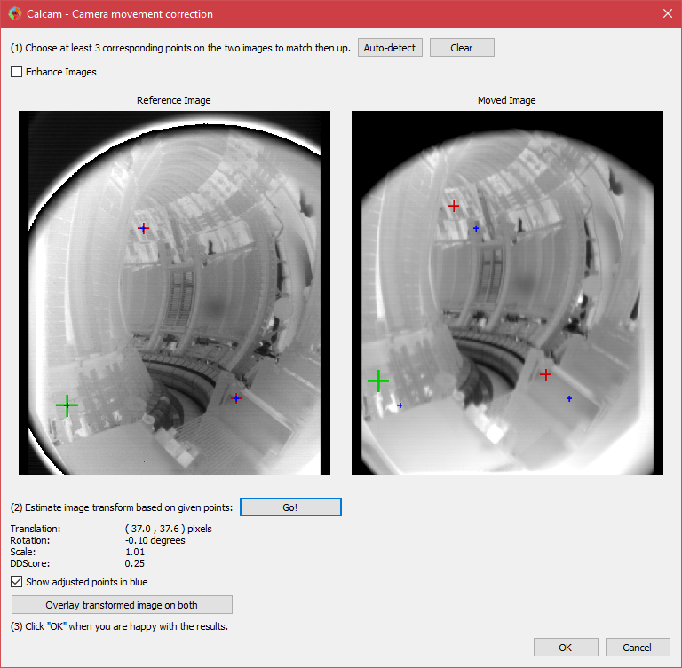

=============================
Camera Movement Determination
=============================

A common issue to deal with is that after a camera has been spatially calibrated, the camera then moves and needs to be re-calibrated. The calcam movement correction GUI provides a tool for aligning a "moved image" to a reference image, resulting in a correction which can be applied to images or calibrations to account for image movement more easily.

Unlike the main GUI tools in calcam, the movement correction GUI cannot be opened from the launcher, but is opened either from within one of the other tools, as needed, or using the :func:`calcam.movement.manual_movement` function if desired.

Introduction
------------
Once opened, the image movement tool GUI is shown below:

The tool is based on identifying a set of corresponding points between the reference and moved images. A minimum of 3 points are required to define the movement between two images.

The GUI shows the two images side-by-side, with the reference image on the left and moved image on the right. If an existing :class:`calcam.movement.MovementCorrection` object is provided to the launcher function, the GUI will start showing the provided movement correction. This can be used, for example, for checking if one movement correction object is suitable for a different moved image. The images can be navigated using the mouse:

- :kbd:`Scroll Wheel` - Zoom in or out, centred at the current mouse position.
- :kbd:`Middle Click + Drag` - Drag the image around.

The reference and moved images will move together if the mouse controls are used on either image.

To make features easier to identify, image enhancement can be applied to the displayed images using the :guilabel:`Enhance Images` checkbox in the top-left of the window.

Identifying Points
------------------

Manually adding points
**********************
Adding matching points between the two images works very similarly to the point-pair based camera calibration tool. Point positions are displayed on the images views as red **+** cursors at the point locations. At any given time, one point pair can be selected for editing. The selected point pair will be indicated with larger green **+** cursors.

Once you have identified a common feature on the two images, :kbd:`Ctrl + Click`  on the location on either image to create a new point pair. A point will be placed at the mouse location. Then click, without holding :kbd:`Ctrl`, the corresponding point on the other image to finish creating the point pair. You should now see green cursors on both images. Clicking either image again will move the green cursor representing the current point to the clicked location. To start another point pair, :kbd:`Ctrl + Click` again and repeat the process. The cursors showing the existing points will turn red, indicating they are no longer selected. In general, left clicking on either image will move the currently selected point to the clicked location. Clicking an existing cursor will select that point pair for editing, and holding :kbd:`Ctrl` while clicking will start a new point pair. The currently selected point pair can be deleted by pressing the :kbd:`Delete` key on the keyboard. All points can be removed at once by clicking the :guilabel:`Clear` button on the left of the window.

Auto-detecting matching points
******************************
The tool includes the option to try to automatically detect a set of corresponding points between the images. This uses the same algorithm as :func:`calcam.movement.detect_movement`, but allows manual checking of the results using the GUI. To auto-detect a set of points, click the :guilabel:`Auto-detect` button to the left of the window. This will remove any existing points on the images and add the set of auto-detected points, if some can be identified. These can then be checked or edited manually be the user as above.

Calculating and checking the movement correction
------------------------------------------------
Once you have at least 3 pairs of matching points on the images, click the :guilabel:`Fit Transformation` button on the left of the window to calculate the transform between the two images. If the sets of points are not sufficiently consistent, the movement will not be estimated and a dialog box stating this will be displayed.

When a transformation is successfully determined, some information about the correction is displayed in the the :guilabel:`Transformation` section on the left of the window:

* The translation, rotation and scale to go from the moved image to the reference image.

* The "DDScore": this is a calculated score estimating how much improved the alignment of the two images is by the determined movement correction. This is a number in the range -1 to 1, where negative values indicate the alignment got worse, 0 is no change and positive numbers indicate an improvement i.e. successful movement correction.

In addition, positions of the corrected points are shown on both images as blue **+** cursors. For a successful movement correction, on the reference (left-hand) images the blue points should align well with the user-clicked red and green cursors. On the right-hand image, the difference between the red and blue cursors shows how much each point has moved. The blue points can be turned on or off with the :guilabel:`Show transformed points in blue` checkbox.

The most direct way to visually assess the movement correction quality is to use the :guilabel:`Overlay transformed image on both` button. While this button is held down, the moved image is adjusted to align with the reference image and overlaid on both image views. For a successful movement correction, the overlaid image should align well on the reference image (left hand side), and the difference on the right-hand side shows how much the image has moved. Clicking, holding down then releasing this button allows quick back-and-forth comparison of the image alignment to assess the movement correction quality.

Saving or Loading corrections
-----------------------------
Movement correcttion data can be saved to files to be re-used later, either by loading it back in to the GUI or when using the Python API. When a transformation has been successfully determined in the tool, the :guilabel:`Save current transformation as...` button is enabled. Click this button to save the correction to a file. To load in a file previously saved in this way, use the :guilabel:`Load from file...` button.

Finishing
---------
If a good movement correction is obtained, clicking :guilabel:`OK` at the bottom of the window will close the dialog box. If the GUI was launched from another calcam window, the movement correction will be applied to whatever you are doing in the other window. If launched from the :func:`calcam.movement.manual_movement` function, the function will return a :class:`calcam.movement.MovementCorrection` object representing the determined movement correction. If :guilabel:`Cancel` is clicked instead, the movement correction in the parent window is not changed, or the :class:`calcam.movement.MovementCorrection` will return ``None``.
