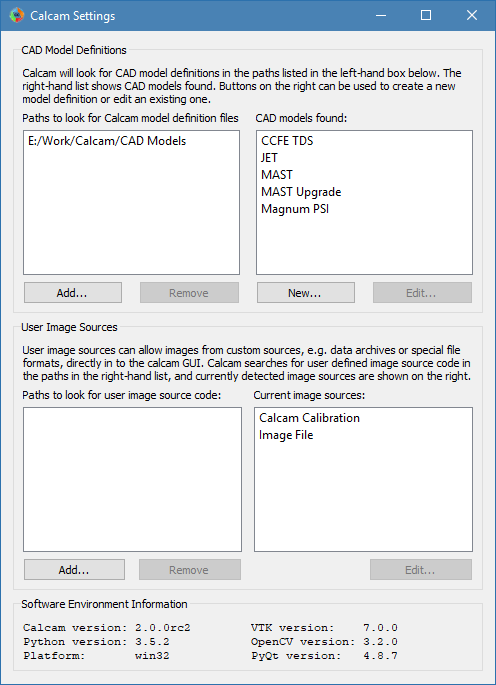
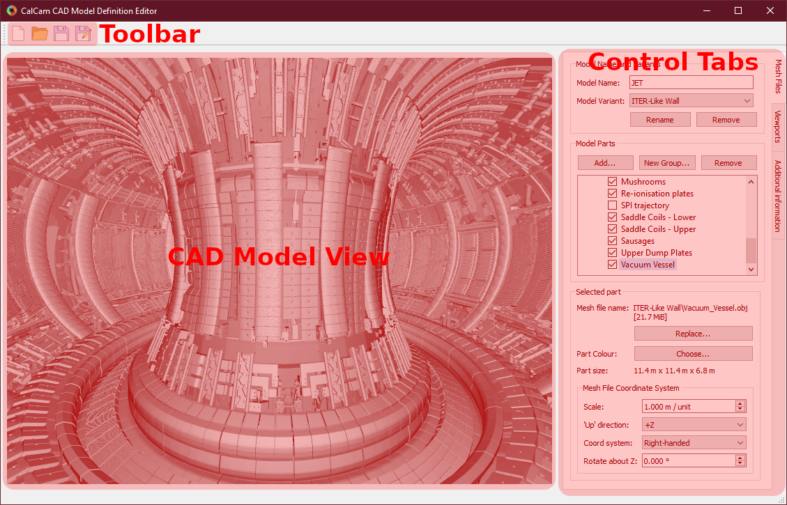

===============
Calcam Settings
===============

The calcam settings GUI allows setup of directories where Calcam should search for CAD model definitions and custom image source definitions; allows access to the CAD model editing tool and also shows software environment information. The settings window is shown below:

CAD Model Definition Settings
-----------------------------

Search Paths
~~~~~~~~~~~~
Calcam looks for CAD model definition (`.ccm`) files in a list of user-set directories which are set using the settings dialog. These are listed in the top-left list box in the settings window. If any of these directories do not exist or are unreadable, they will appear in red, otherwise they are listed in black. Directories to look for `.ccm` files can be added or removed using the buttons underneath the path list box. Note: the CAD model search does not traverse sub-directories, so if a subdirectory of a directory already in the list contains more definition files, it must still be added separately.

CAD model definitions detected in the CAD model search paths are listed in the top-right list box in the settings window. These are the CAD models which will be available to choose from in Calcam GUI tools. You can select an existing model in this list and click the :guilabel:`Edit...` button under the CAD model list to open the CAD model editor with that model, or use the :guilabel:`New...` button under the CAD model list to create a new model definition. The list is refreshed periodically, so creating or removing model definitions will be automatically reflected in the list.

.. _cad_editor:

The CAD Model Definition Editor
~~~~~~~~~~~~~~~~~~~~~~~~~~~~~~~
The CAD model editing window is shown below:

Basic Model Properties
**********************
At the top of the :guilabel:`Mesh Files` control tab is a box to enter the name of the CAD model. Below this is a dropdown box showing the different variants of the model, where new variants can be added or the current variant renamed or removed, using the buttons directly below the :guilabel:`Model Variant` dropdown box.

Adding and organising model parts
*********************************
In the centre of the :guilabel:`Mesh Files` tab is a tree vbiew showing the parts of the model. Each part corresponds to a single 3D mesh file. To add a new part, click the :guilabel:`Add...` button above the part tree to browse for one or more mesh file(s) to add. Currently Calcam supports `.obj` and `.stl` format 3D mesh files. The selected file(s) will be added to the 3D view and the part tree, with a part name corresponding to the mesh file name. To rename a part, double-click on its name and type the new name. 

A part can be selected in the feature tree by clicking on its name. With the part selected, information about the part are shown in the :guilabel:`Selected Part` box at the bottom of the :guilabel:`Mesh Files` tab. This includes the mesh file name and file size and the physical size of the part. The mesh representing this part can be exchanged for a different file using the :guilabel:`Replace...` button under the mesh file details. Below this, the mesh file scale can be set. The mesh file scale is the physical length, in metres, which corresponds to a length of 1 in the loaded mesh file. For example if the model has been exported from CAD software in units of mm, this should be set to 0.001 to scale the model correctly. Whether the model is scaled correctly can be seen by checking that the displayed physical size of the part is as expected. Finally, the colour of the part can be changed using the :guilabel:`Choose...` button at the bottom of the tab.

To logically organise CAD model parts, they can be collected in to groups. To create a group, click the :guilabel:`New Group...` box above the model part tree and enter a name for the group. Parts can be moved in and out of groups by clikcing and dragging the parts as desired in the parts tree. Groups can be convenient because the user can quickly turn on or off all items in a group together, and if the model is split in to a large number of parts it can be helpful to logically organise them. An example feature tree with parts split in to groups is shown below:

.. image:: images/screenshots/model_parts_grouped.png
   :alt: Grouped CAD model parts

To remove a part from the CAD model, select it from the feature tree and click the :guilabel:`Remove` button above the model tree.

Features can be turned on or off by ticking or un-ticking the checkbox next to the feature's name. Features which are ticked when saving the model definition will load by default whenever the model is loaded, while any un-ticked features will not be loaded by default.

Viewport Setup
**************
It is usually convenient to define some preset views of the model (i.e. camera positions and orientations) which can be quickly switched to e.g. as starting points for calibrations. For example, it is usually convenient to make preset views through ports which are usually used for cameras. Viewport setup is performed on the :guilabel:`Viewports` tab. At the top of this tab is a list of the viewports defined in the CAD model definition. At least one view must be defined before saving the CAD model definition, to be set automatically when the CAD model is loaded.

To add the current 3D view shown in the window as a preset view, enter a name for the view in the box half way down the :guilabel:`Viewport` tab and click :guilabel:`Add`. The current viewport can be adjusted either with mouse controls or by manually entering the 3D position and viewing target of the camera in the boxes near the bottom of the tab. To control the viewport with the mouse, the following mouse controls can be used on the 3D view:

- :kbd:`Left Click` - Place a cursor on the 3D model, or move the cursor if one already exists. This will display information about the cursor position in the window status bar and can be used by cross-sectioning / wall contour display features.
- :kbd:`Right Click + Drag` - Look around (first-person shooter style control; default) or rotate CAD model depending on settings
- :kbd:`Middle Click + Drag` - Pan (translate) sideways i.e. in the plane of the monitor.
- :kbd:`Scroll Wheel` - Move forwards or backwards.
- :kbd:`Ctrl + Scroll Wheel` Reduce or increase the CAD field-of-view angle (i.e. Zoom)
- :kbd:`Ctrl + Right Click + Drag` - Roll the camera (rotate about the direction of view)

When multiple views are defined in a CAD model, the default view, i.e. the view set automatically when the model is loaded, can be set by selecting the view in the view list and clicking :guilabel:`Set As Default (*)` under the view list. The current default view is marked with an asterisk `*`. To remove an existing view, select it and click the :guilabel:`Remove` button.

Adding Additional Information
~~~~~~~~~~~~~~~~~~~~~~~~~~~~~
Additional information can be added to the CAD model definition using the :guilabel:`Additional information` tab:

R,Z Wall Contour
****************
An R,Z wall contour can be saved as part of the model definition; currently this is only used for displaying in the 3D viewer but is intended to be used in future for geometry matrix calculation, for example. To add an R,Z wall contour to the CAD model, prepare the contour in a two-column ASCII file containing R,Z coordinates of the wall (in metres) around the poloidal cross-section, with one coordinate per line in the file. Then click :guilabel:`Load from file...` in the :guilabel:`R, Z Wall Contour` box to load the file. If a wall contour already exists in the model, its details will also be displayed in this box. If a cursor is placed on the 3D model, the current wall contour can be displayed, at the cursor position, using the :guilabel:`Show contour at cursor position` checkbox.

3D Coordinate Information
*************************
In various places in Calcam, the 3D position of a point on the CAD model is displayed. By default, the :math:`X,Y,Z` coordinates in metres and :math:`R,Z,\phi` coordinates are displayed. However, it is often helpful to have more machine-specific information added to this. For example, on a tokamak usually divided in to toroidal segments, it can be helpful to display which segment something is in, or you may want to display coordinates in different units. This can be achieved by writing a custom coordinate formatting function in Python, which can be saved as part of the model definition and is used to generate the 3D coordinate information to be displayed. This takes the form of a user-written python module or package, and details of how to write such a formatter are given :doc:`here <dev_coord_formatter>`. Once created, you can use the :guilabel:`Load custom...` button in the :guilabel:`3D coordinate information` box to browse for the python code (Note: if your coordinate formatter code is a Python package rather than a single module, in the file selection dialog, select the __init__.py file of the package). At the top of the :guilabel:`3D coordinate information` box is information about the current coordinate formatter. If a cursor is currently placed on the model, the output of the coordinate formatter for its current location is shown. If you have loaded a custom coordinate formatter and want to make changes to its code "live", you can use the :guilabel:`Refresh` button to re-load the currently loaded python file. If a custom coordinate formatter is already loaded or already exists in the model, an :guilabel:`Edit...` button is displayed which will open the python file or folder for editing. To remove the custom formatting code from the model and revert to the default built-in coordinate display, use the :guilabel:`Remove` button.

Loading & Saving Models
***********************
Changes to the currently loaded model can be saved using the :guilabel:`Save` or :guilabel:`Save As` buttons on the toolbar. A different CAD model definition can be loaded with the :guilabel:`Open` button, or a new empty CAD model definition can be started with the :guilabel:`New` button. When saving a model definition, if the definition is saved to a directory not currently in Calcam's CAD model search path, you will be prompted to add that location so that the saved CAD model will be visible in the other Calcam GUI tools.

Image Source Settings
---------------------
User image sources are a way to plug in custom Python code to Calcam for loading images to be calibrated. By default, Calcam can load images from most common image file formats, however it may be convenient to be able to load images e.g. from an experimental data server or custom file format. This is achieved by writing custom image source code, which takes the form of a python module or package. Details of how to write a custom image source are given :doc:`here <dev_imsources>`.

Calcam searches for user-written image sources in the list of paths displayed in the bottom-left list box in the Settings window.  If any of these directories do not exist or are unreadable, they will appear in red, otherwise they are listed in black. Directories to look for image source python code can be added or removed using the buttons underneath the path list box. Note: the image source search does not traverse sub-directories, so if a subdirectory of a directory already in the list contains more image sources, it must still be added separately.

The list box in the bottom-right of the Settings window shows all python modules and packages detected in the image source search paths. If these are working and can be used as image sources, the name of the corresponding image source is displayed in black. If there is a python module but it is not an image source or is not working for some reason, it will be shown in read. Hovering the mouse over an image source listed in red will show the reason why it is not working. In addition to user created image sources, the two Calcam built-in image sources: loading from image files or calcam calibration files, are always shown.

Custom image sources can be selected by clicking them in the image source list, which will enable the :guilabel:`Edit...` button under the image source list. Clicking this button will open the python file or folder corresponding to the image source. The image source list is periodically refreshed, so if you make changes to the image source code e.g. to try and fix a non-working image source, or creating a new image source in one of the search paths, this change will be reflected in the list.

Environment Information
-----------------------
At the bottom of the window, information about the current software environment is displayed. This includes the OS platform, current versions of Calcam and Python, and the most critical dependencies: VTK, OpenCV and PyQt. This information can be useful when troubleshooting bugs or unexpected behaviour of the software.